# AI Terms

<details>
  <summary>LLM — Large Language Model</summary>

##  LLM — Large Language Model

### The Simple Definition
An LLM is an **AI that has read a massive amount of text** (books, websites, articles, code, etc.) and learned how to **understand and generate human language** from it.

### Real-Life Analogy

Imagine a student who has **read millions of books, articles, and websites** their entire life. Now when you ask them a question or give them a topic — they can **write about it, answer it, or have a conversation** because of everything they've absorbed.

An LLM is that student — except it's a computer program.

### Breaking Down the Name

| Word | What it means |
|------|--------------|
| **Large** | Trained on a huge amount of text data (think billions of web pages) |
| **Language** | It works with human language — reading and writing it |
| **Model** | A mathematical system that learned patterns from all that text |

### How does it actually work? (Super Simply)

You give it some text → It **predicts what comes next** — word by word.
That's literally it at the core!


### Real Examples of LLMs
- **ChatGPT** by OpenAI
- **Claude** by Anthropic
- **Gemini** by Google

### One Line Summary
> An LLM is a very well-read AI that learned how to talk by reading most of the internet — and now predicts the best words to respond to you.

</details>

<details>
  <summary>Tokenisation</summary>

## Tokenisation

### The Simple Definition
Before an LLM can understand your text, it needs to **break it into small chunks** called **tokens**. This process of breaking text into chunks is called **tokenisation**.

> An LLM doesn't read words like we do — it reads **tokens**.

### Real-Life Analogy

Think of it like a **pizza being sliced**.

The whole pizza = your sentence.
Each slice = a token.

You don't eat the whole pizza at once — you eat it **slice by slice**. Similarly, the LLM doesn't read your sentence all at once — it processes it **token by token**.

### What exactly is a token?

A token can be:
- A **whole word** → `cat` = 1 token
- A **part of a word** → `unbelievable` = `un` + `believ` + `able` = 3 tokens
- A **punctuation mark** → `.` or `!` = 1 token
- A **space + word** → ` the` = 1 token

### Example — let's tokenise a sentence!

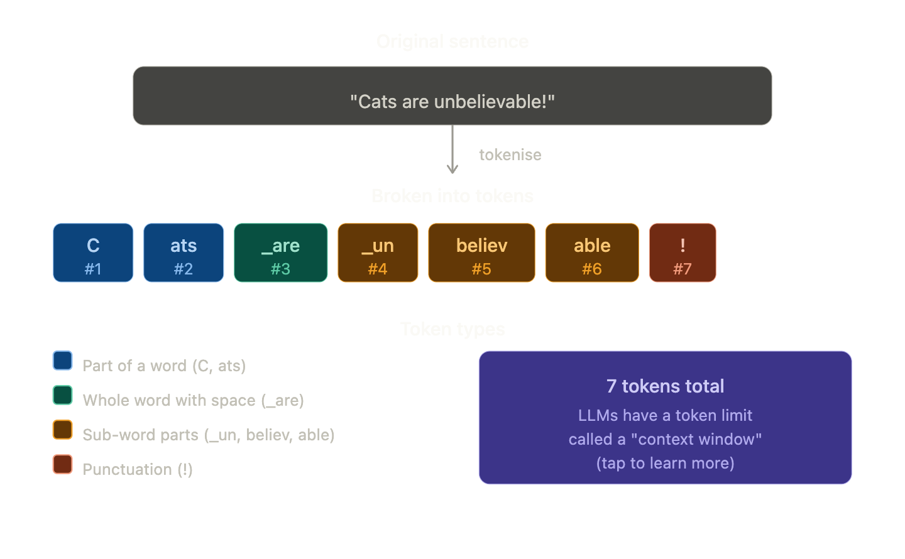

### Why does this matter?

**1. LLMs think in tokens, not words**
When you send a message, it gets converted to tokens first, then the LLM processes them one by one.

**2. Cost & limits are measured in tokens**
Most AI APIs charge you **per token**. A typical page of text ≈ 500–700 tokens.

**3. Longer words = more tokens**
Simple words like `cat` = 1 token. Complex words like `unbelievable` = 3 tokens. This is why AI can sometimes struggle more with rare or technical words.

### Quick Rule of Thumb
> 🧮 **~1 token ≈ ¾ of a word** in English
> So 100 words ≈ roughly 130–140 tokens

### One Line Summary
> Tokenisation is the process of chopping your text into small bite-sized pieces (tokens) that an LLM can actually understand and process.

</details>

<details>
  <summary>Vectorisation</summary>

## Vectorisation (also called "Embeddings")

### The Simple Definition
After tokenisation, the LLM needs to convert each token into a **list of numbers** so the computer can do math on it. This process is called **vectorisation**.

> Computers don't understand words — they only understand numbers. Vectorisation is the **translation layer** between human language and machine math.


### Real-Life Analogy

Think of it like a **GPS coordinate system**.

- Every city in the world has a unique location: `(latitude, longitude)`
- London = `(51.5, -0.1)`, Tokyo = `(35.7, 139.7)`
- You can now **measure distance** between cities using math

Vectorisation does the same for words:
- Every word gets a unique "location" in **meaning space**
- `king` = `[0.2, 0.8, 0.5, ...]`, `queen` = `[0.2, 0.7, 0.9, ...]`
- Now you can measure how **similar or different** words are — using math!

### The Magic Part

Because words are now numbers, you can do **arithmetic on meaning**:

> king − man + woman ≈ queen

The model understands relationships between concepts purely through numbers!
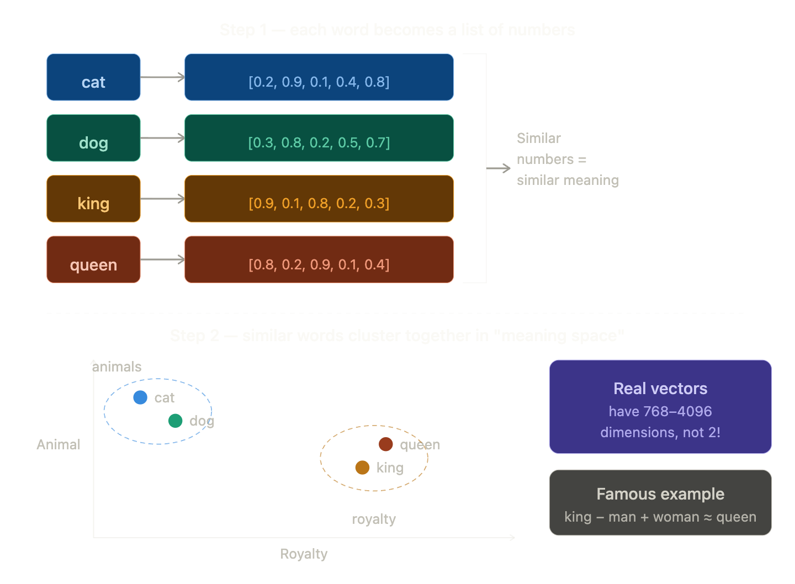

### One Line Summary
> Vectorisation turns words into lists of numbers so that the computer can understand meaning mathematically — and words with similar meanings end up with similar numbers.

</details>

<details>
  <summary>Attention</summary>

## Attention (Self-Attention)

### The Simple Definition
Attention is how an LLM figures out **which words in a sentence are most important to each other** when trying to understand meaning.

> It's the LLM asking: *"When I'm reading this word, which other words should I pay attention to?"*


### Real-Life Analogy

Imagine reading this sentence:

> *"The animal didn't cross the street because **it** was too tired."*

What does **"it"** refer to? The animal? The street?

Your brain **automatically focuses** on "animal" because it makes more sense in context. You ignored "street" for this purpose.

That's exactly what attention does — it helps the LLM figure out **which words are connected to which**, even across long distances in a sentence.

### Another Analogy — The Spotlight 

Imagine a stage with many actors (words). When one actor speaks, a **spotlight** shines on the other actors that are most relevant to what they're saying. Brighter spotlight = more attention.

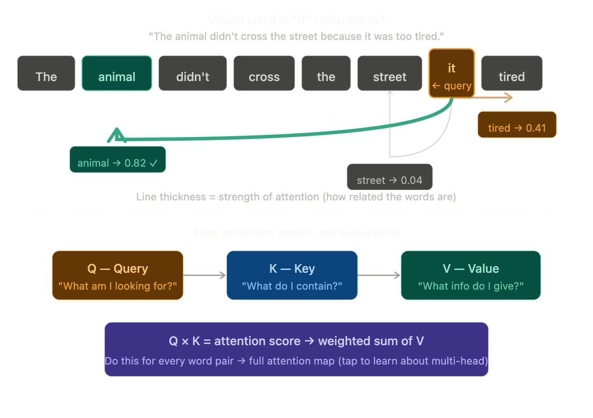

### The Q, K, V Trio — Simply Explained

Every word gets 3 roles simultaneously:

| Role | Question it asks | Analogy |
|------|-----------------|---------|
| **Q — Query** | "What am I looking for?" | A Google search query |
| **K — Key** | "What topic do I cover?" | A book's index keyword |
| **V — Value** | "What info do I actually carry?" | The book's actual content |

When word **"it"** (Query) searches for meaning, it matches against every other word's **Key**. The best match (animal) gets the highest score, so its **Value** (meaning) flows back strongly into "it".

### Why is Attention so powerful?

Before attention, AI read sentences **left to right, one word at a time** like a typewriter. It would often forget earlier words by the time it reached the end.

Attention lets the model **look at ALL words simultaneously** and decide what's relevant — no matter how far apart they are in the sentence.

### One Line Summary
> Attention is how the LLM figures out which words are connected to which — so it understands that "it" means "the animal", not "the street".

</details>

<details>
  <summary>Self-Supervised Learning</summary>

## Self-Supervised Learning

### The Simple Definition
Self-Supervised Learning is a way of training an AI where the **data creates its own labels automatically** — no human needed to manually tag anything.

> The AI learns by playing a **fill-in-the-blank game** with text — over and over, billions of times.

### Real-Life Analogy

Remember doing **fill-in-the-blank exercises** in school? 

> *"The sky is ____."* → You write "blue"

Nobody had to tell you the answer beforehand — you already knew from **experience reading and hearing** that sentence pattern your whole life.

Self-supervised learning works the same way:
- Take a sentence from the internet
- **Hide a word**
- Ask the AI to guess it
- Tell the AI if it was right or wrong
- **Repeat billions of times**

The AI gradually gets better and better — and in doing so, it learns grammar, facts, reasoning, and meaning — all on its own!


### What does the AI actually learn from this? 

By playing this guessing game **billions of times**, the AI doesn't just memorise answers — it picks up much deeper knowledge:

- **Grammar** — "The cat ___ on the mat" → needs a verb
- **Facts** — "The capital of France is ___" → Paris
- **Reasoning** — "If it's raining, take an ___" → umbrella
- **Style** — "Once upon a time ___" → story language follows

Nobody programmed any of this in. It all **emerged naturally** from the guessing game!

### The clever trick

The magic is that **every sentence on the internet is simultaneously**:
- The **training data** (input text)
- The **label** (the hidden word answer)

So the entire internet becomes a free, infinite training set!

### One Line Summary
> Self-supervised learning is how an LLM teaches itself by playing a fill-in-the-blank game on billions of internet sentences — no human labelling needed.

</details>

<details>
  <summary>Transformer</summary>

## Transformer

### The Simple Definition
A Transformer is the **overall architecture (design/structure)** of how modern LLMs are built. It's the blueprint that combines everything you've learned so far into one powerful system.

> If an LLM is a car , the Transformer is the **engine design** that makes it work.


### Real-Life Analogy

Think of a **busy post office** that processes thousands of letters simultaneously:

- Each letter (token) gets **read by everyone at once** — not one by one
- Sorters (attention heads) figure out **which letters relate to which**
- The whole batch gets processed **in parallel**, not sequentially

Before Transformers, AI read text like a slow typist — **one word at a time, left to right**. The Transformer said: *"Why not read everything at once?"* That single idea changed everything.


### The origin — "Attention is All You Need" 

In 2017, Google researchers published a paper with that exact title. It introduced the Transformer. Within a few years, it became the foundation of **GPT, Claude, Gemini, BERT** — essentially every major AI system today.

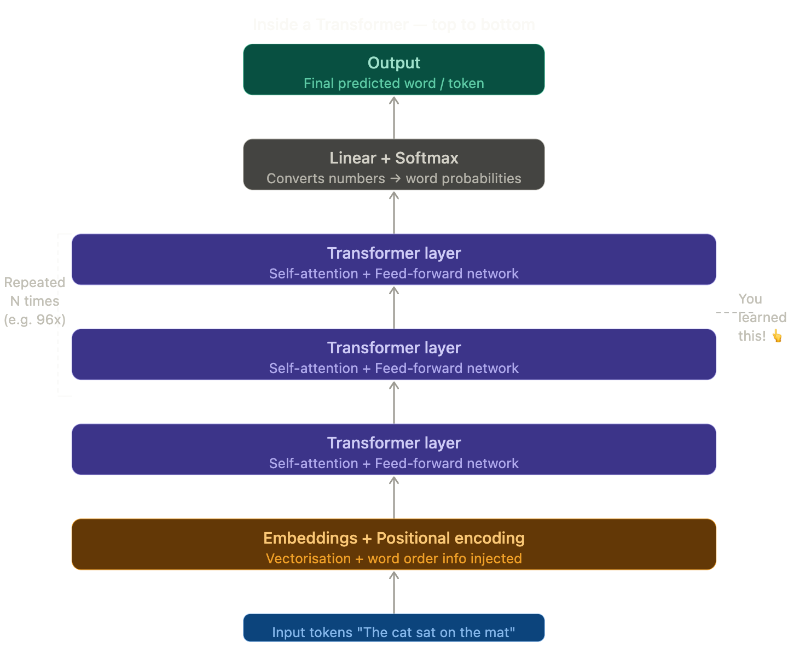

### What's inside each Transformer layer?

Each layer has **two key parts** working together:

**1. Self-Attention** (you already know this!)
Figures out which words relate to which — "it" → "animal"

**2. Feed-Forward Network**
A mini neural network that takes the attention output and **transforms it further** — adding deeper reasoning and pattern recognition on top.

Then each layer passes its output **up to the next layer**, each one building a richer and richer understanding of the text.

### Why stacking layers matters

| Layer | What it tends to learn |
|-------|----------------------|
| Early layers | Grammar, spelling, word structure |
| Middle layers | Facts, relationships, context |
| Deep layers | Complex reasoning, tone, logic |

GPT-3 has **96 layers**. Claude and GPT-4 likely have even more. Each layer refines the understanding further.

### The secret superpower

The Transformer processes **all tokens simultaneously** — not one by one. This means:
- It can be trained on **massive data very fast** (using GPUs in parallel)
- It can **attend to any word** no matter how far away in a sentence
- It **scales beautifully** — more layers + more data = smarter AI

### One Line Summary
> A Transformer is the architectural blueprint of modern AI — it stacks multiple layers of attention and reasoning on top of each other to understand and generate language with remarkable depth.

</details>

<details>
  <summary>Fine-tuning</summary>

## Fine-Tuning

### The Simple Definition
Fine-tuning is the process of taking an already-trained LLM and **training it further on a smaller, specific dataset** to make it better at a particular task or behaviour.

> Think of it as **taking a university graduate and giving them specialised job training**.


### Real-Life Analogy

Imagine a **medical student** :

- They spend **6 years in medical school** learning everything — biology, chemistry, physics, anatomy (this is **pre-training**, like the Transformer stage)
- Then they do a **2-year residency** specialising in cardiology — focused, specific, real-world training (this is **fine-tuning**)

The residency doesn't erase everything they learned. It **builds on top of it** and sharpens their skills for a specific job.

An LLM works exactly the same way!


### Pre-training vs Fine-tuning at a glance

| | Pre-training | Fine-tuning |
|--|-------------|-------------|
| **Data** | Trillions of internet words | Thousands of curated examples |
| **Time** | Weeks to months | Hours to days |
| **Cost** | Millions of dollars | Much cheaper |
| **Goal** | Learn language & world knowledge | Learn specific behaviour or task |
| **Who does it** | AI labs (Anthropic, OpenAI) | Companies, developers, researchers |

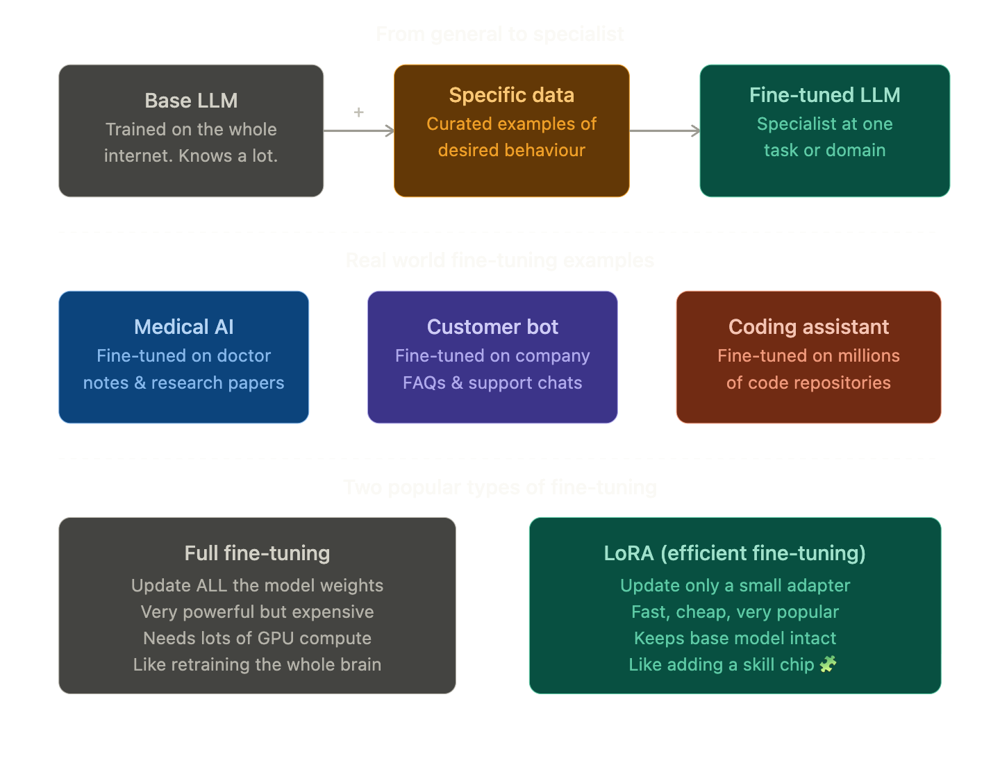


### A special type of fine-tuning — RLHF

One of the most important fine-tuning techniques is called **RLHF — Reinforcement Learning from Human Feedback**. This is how Claude and ChatGPT were made to be **helpful, harmless, and honest**.

Here's how it works simply:

1. The base LLM generates several responses to a question
2. **Human raters** rank which response is best
3. The model learns from those rankings
4. It gradually gets better at giving responses humans prefer

> This is why Claude doesn't just dump raw information — it explains things clearly, stays safe, and avoids harmful content. That behaviour was **fine-tuned in** via RLHF!

### What fine-tuning does NOT do 

Fine-tuning **doesn't add new knowledge** — it shapes **behaviour and style**. For example:
- It can make the model respond only in formal English ✅
- It can make the model always answer as a customer service agent ✅
- It **cannot** teach the model facts about events after its training cutoff ❌


### One Line Summary
> Fine-tuning takes a general-purpose LLM and gives it specialised training on a focused dataset — turning a generalist into an expert for a specific task or behaviour.


</details>

<details>
  <summary>Few-shot Prompting</summary>

## Few-Shot Prompting

### The Simple Definition
Few-shot prompting is a technique where you **give the AI a few examples** of what you want **inside your prompt itself**, before asking it to do the actual task.

> You're not training the AI — you're just **showing it the pattern** you want it to follow, right in the conversation.

### Real-Life Analogy

Imagine you're a **new employee** and your boss gives you a task:

**Bad briefing:**
> "Write product descriptions for our store."

You'd probably guess what format they want and get it wrong.

**Good briefing:**
> "Here are two product descriptions we've already written... *(shows examples)*... Now write one for this new product."

Now you know exactly the **tone, length, and format** they want. That's few-shot prompting!

### The "Shot" Family

| Name | Examples given | When to use |
|------|---------------|-------------|
| **Zero-shot** | 0 examples | Simple tasks AI already knows well |
| **One-shot** | 1 example | When you have one clear example |
| **Few-shot** | 2–5 examples | Best for specific patterns or formats |
| **Many-shot** | 10+ examples | Complex, highly specific tasks |


### Real Examples You Can Use Today 

**Example 1 — Tone matching:**
> Write product titles in this style:
> "Noise-cancelling headphones" → "Silence the World, Hear Your Music"
> "Waterproof jacket" → "Stay Dry, Look Sharp"
> Now do: "Running shoes" → ?

**Example 2 — Data formatting:**
> Convert to structured format:
> "John, 28, New York" → Name: John | Age: 28 | City: New York
> "Sara, 34, London" → Name: Sara | Age: 34 | City: London
> Now do: "Ahmed, 22, Dubai" → ?

### Why does it work?

Remember **Attention** and **Vectorisation**? The AI uses those mechanisms to detect the **pattern** in your examples and continue it. You're essentially guiding the attention mechanism by showing it exactly what relationships matter to you.

You're not changing the model — you're giving it a **very strong hint** from inside the prompt itself.

### Few-shot vs Fine-tuning — what's the difference?

| | Few-shot prompting | Fine-tuning |
|--|-------------------|-------------|
| **Where** | Inside the prompt | Changes the model weights |
| **Cost** | Free, instant | Expensive, takes time |
| **Persistence** | Only for that conversation | Permanent change |
| **Best for** | Quick formatting, style | Deep behavioural change |


### One Line Summary
> Few-shot prompting means giving the AI 2–5 examples of what you want inside your prompt, so it learns your exact pattern and follows it — no training required.

</details>

<details>
  <summary>Retrieval Augmented Generation</summary>

## RAG — Retrieval Augmented Generation

### The Simple Definition
RAG is a technique where instead of relying only on what the LLM learned during training, it first **fetches relevant information from an external source** and then uses that to generate its answer.

> The LLM gets to **look things up** before answering — like an open-book exam instead of a closed-book one.

### The Problem RAG Solves

LLMs have two big limitations:

**1. Knowledge cutoff** — They only know things up to when they were trained. Ask Claude about news from last week? It won't know.

**2. Hallucination** — When an LLM doesn't know something, it sometimes **makes up a confident-sounding answer**. This is dangerous in fields like medicine, law, and finance.

RAG fixes both problems by giving the LLM **real, fresh, verified information** to work from.

### Real-Life Analogy

Imagine two types of doctors️:

**Doctor A (no RAG):** Answers purely from memory of medical school. Confident, but might be outdated or occasionally wrong.

**Doctor B (with RAG):** Before answering, quickly pulls up your medical records, latest research papers, and current treatment guidelines — then gives you an answer based on all of that.

Doctor B is going to give you a much better answer! That's RAG.

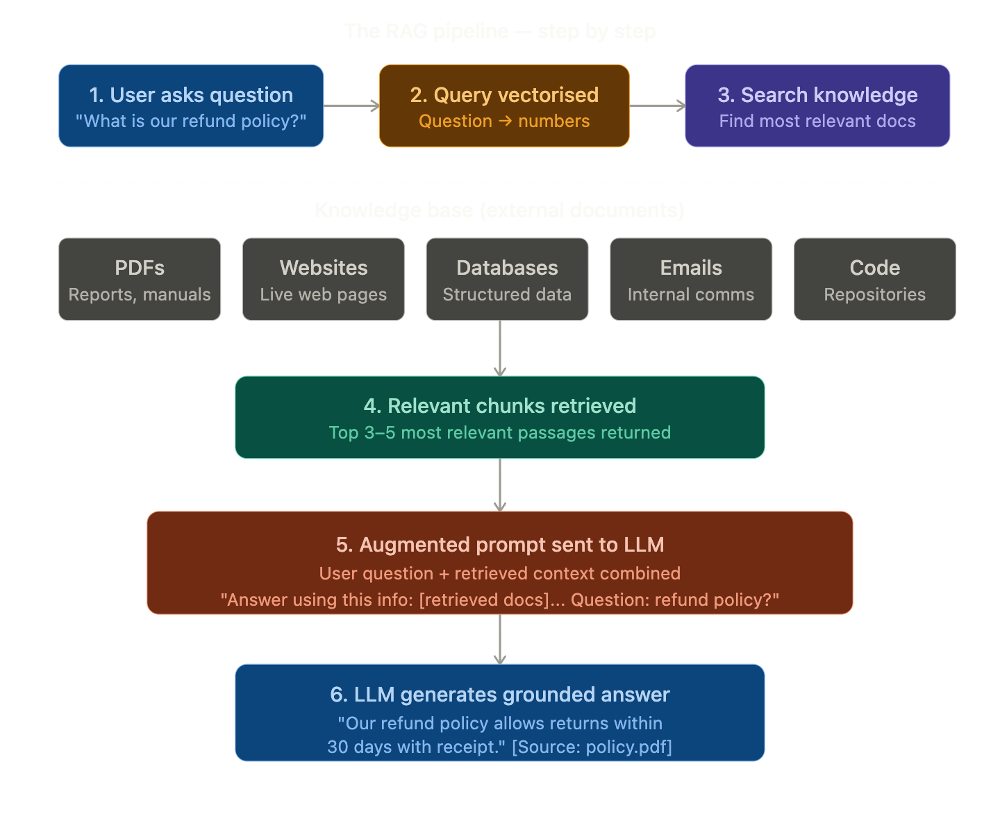

### RAG vs Pure LLM — head to head

| | Pure LLM | LLM with RAG |
|--|---------|-------------|
| **Knowledge** | Only what it was trained on | Any external document you give it |
| **Up to date?** | No — has a cutoff date | Yes — can use live data |
| **Hallucination risk** | Higher | Much lower |
| **Can cite sources?** | No | Yes! |
| **Cost** | Cheaper | Slightly more compute |
| **Best for** | General conversation | Specific, factual, domain tasks |

### Real World RAG Examples 

- **Customer support bot** — searches your company's FAQ and policy documents before answering
- **Legal AI** — retrieves relevant case law before giving advice
- **Medical assistant** — pulls latest research papers before suggesting treatments
- **This conversation!** — When I use web search to find current information, that's RAG in action 

### The clever bit — Vector Search

Remember **Vectorisation** from earlier? RAG uses it brilliantly:

1. All your documents are pre-converted to vectors and stored in a **vector database**
2. Your question is also converted to a vector
3. The system finds documents whose vectors are **closest** (most similar) to your question vector
4. Those documents get retrieved — fast, even across millions of pages!

### One Line Summary
> RAG lets an LLM look up relevant information from external documents before answering — making it more accurate, up-to-date, and trustworthy than relying on memory alone.

</details>


<details>
  <summary>Vector Database</summary>

## Vector Database

### The Simple Definition
A Vector Database is a special type of database designed to **store, search, and retrieve vectors** (those lists of numbers from Vectorisation) extremely fast — by finding the ones that are **most similar** to a given query vector.

> It's a database that understands **meaning**, not just exact matches.

### Real-Life Analogy

Think of a **regular library vs a smart librarian**:

**Regular database** (like a filing cabinet):
> "Find me the file named exactly *cat.txt*"
> If you search for "feline", you get nothing. It only matches exact names.

**Vector database** (the smart librarian):
> "Find me everything related to cats"
> Returns: files about cats, kittens, felines, pets, lions — because it understands **similarity of meaning**!

That's the superpower of a vector database — it finds things by **how similar their meaning is**, not by exact word matching.

### Regular Database vs Vector Database

| | Regular Database | Vector Database |
|--|----------------|----------------|
| **Stores** | Text, numbers, dates | Vectors (lists of numbers) |
| **Searches by** | Exact match | Similarity of meaning |
| **Query example** | `WHERE name = 'cat'` | "Find me things like cat" |
| **Good for** | Structured records | Semantic / meaning search |
| **Examples** | MySQL, PostgreSQL | Pinecone, Weaviate, ChromaDB |

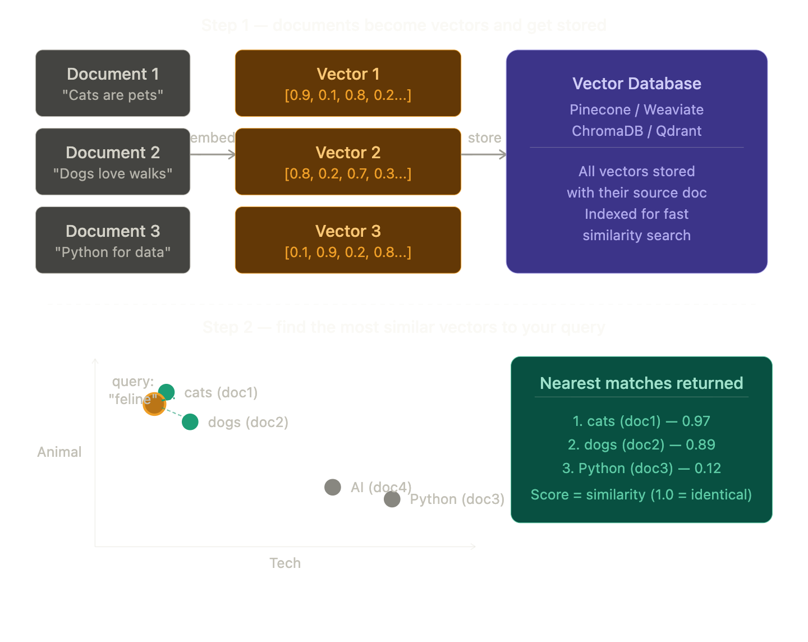

### How similarity is measured — Cosine Similarity

The most common way vector databases measure similarity is called **cosine similarity**. Simply put:

- Two vectors pointing in the **same direction** = very similar (score close to 1.0)
- Two vectors pointing in **opposite directions** = very different (score close to 0.0)

Think of it like two arrows on a compass — the closer their directions, the more similar their meaning!

### How it all connects — RAG + Vector DB together

You now know the complete RAG pipeline with Vector DB:

1. **Documents** get converted to vectors → stored in **Vector Database**
2. User asks a question → question converted to a vector
3. **Vector Database** finds the most similar document vectors
4. Those documents are retrieved and sent to the **LLM**
5. LLM generates a grounded, accurate answer

> The Vector Database is the **fast, smart search engine** inside RAG!


### Popular Vector Databases 

| Tool | Best known for |
|------|---------------|
| **Pinecone** | Managed, easy to use, production ready |
| **Weaviate** | Open source, flexible |
| **ChromaDB** | Lightweight, great for local development |
| **Qdrant** | Fast, open source, Rust-based |
| **pgvector** | Adds vector search to regular PostgreSQL |

### One Line Summary
> A Vector Database stores text as vectors (numbers) and retrieves the most meaningfully similar ones to a query — making it the backbone of semantic search and RAG systems.

</details>


<details>
  <summary>MCP — Model Context Protocol</summary>

## MCP — Model Context Protocol

### The Simple Definition
MCP is a **standard way for AI models to connect to external tools, data sources, and services** — so the AI can take actions in the real world, not just generate text.

> Think of it as a **universal plug socket** for AI. Instead of every AI needing a custom connection to every tool, MCP gives one standard way to connect to anything.

### The Problem MCP Solves

Without MCP, connecting an AI to external tools was messy:

- Every company built their **own custom integration** between their AI and their tools
- Connecting Claude to Google Drive was different from connecting it to Slack, which was different from GitHub...
- Developers had to **rewrite connection code** every single time
- It was like every country having **different shaped plug sockets** — your appliance only works in one country!

MCP says: *"Let's agree on one standard shape for all plugs."*

### Real-Life Analogy

Think of **USB**:

Before USB, every device had its own connector. Printers, keyboards, mice — all different cables, all incompatible.

Then USB came along and said: *"One standard port for everything."* Suddenly any device worked with any computer.

**MCP is the USB of AI tools.** One standard protocol so any AI can connect to any tool — without custom wiring every time.


### The Three Parts of MCP

MCP has three key components that work together:

**1. MCP Host** — The AI application (like Claude)
The AI that wants to use external tools. It asks: *"What tools are available and how do I use them?"*

**2. MCP Server** — The tool provider (like Google Drive)
A small program that wraps a tool and exposes it in the standard MCP format. It says: *"Here's what I can do and how to call me."*

**3. MCP Protocol** — The agreed language between them
The standard rules both sides follow — like a contract that ensures they always understand each other.

### MCP vs RAG — what's the difference?

These two are often confused because both give AI access to external information:

| | RAG | MCP |
|--|-----|-----|
| **Purpose** | Retrieve documents for context | Connect to tools and take actions |
| **Direction** | One way — AI reads data | Two way — AI reads AND writes |
| **Example** | Search company docs for an answer | Send an email, create a task, run code |
| **Data** | Static documents | Live systems and services |

> RAG gives the AI a **library**. MCP gives the AI **hands**.

### A Personal Connection!

You've seen MCP in action right here in this conversation. When I searched the web earlier in our chat, I was using a tool connected via a protocol just like MCP — fetching real-time information and bringing it back to answer your questions.

### One Line Summary
> MCP is a universal standard protocol that lets AI models connect to any external tool or service — giving AI the ability to take real actions in the world, not just generate text.

</details>

<details>
  <summary>Context Engineering</summary>

## Context Engineering

### The Simple Definition
Context Engineering is the **art and science of carefully designing what information you put into an AI's context window** — so it has exactly the right knowledge, instructions, and examples to perform at its best.

> It's not just about what you ask the AI. It's about **everything you surround your question with**.

### The Problem It Solves 

People used to think getting good AI results was about writing clever prompts — one magic sentence that unlocks the perfect answer.

The reality is much deeper. A great AI response depends on:
- **What instructions** the AI has been given
- **What examples** it can see
- **What tools** are available to it
- **What memory** it has of past conversations
- **What documents** have been retrieved for it
- **What state** the conversation is in

Context Engineering is about **orchestrating ALL of these things together** — not just tweaking a single prompt.

### Real-Life Analogy

Think of a **world-class chef**:

**Bad kitchen setup:** The chef shows up with no recipe, random ingredients, dull knives, and no idea what the customer wants.

**Great kitchen setup:** The chef has the exact recipe, fresh ingredients pre-measured, sharp tools laid out perfectly, and knows the customer's allergies and preferences.

Same chef — completely different result. **The setup is everything.**

Context Engineering is **setting up the perfect kitchen** for your AI chef.

### Prompt Engineering vs Context Engineering

| | Prompt Engineering | Context Engineering |
|--|-------------------|-------------------|
| **Focus** | Wording of one message | Everything in the context window |
| **Scope** | A single prompt | Entire AI system design |
| **Who does it** | Users, writers | AI engineers, system builders |
| **Tools used** | Just text | RAG, memory, tools, instructions |
| **Analogy** | Asking a good question | Building the whole classroom |


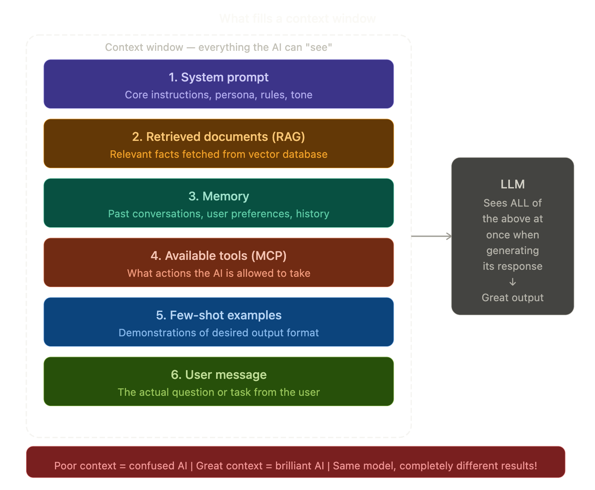

### The Six Ingredients of Great Context

Every ingredient in the diagram connects back to what you've already learned:

**1. System Prompt** — Core instructions telling the AI who it is, how to behave, and what rules to follow. Example: *"You are a helpful medical assistant. Always cite sources. Never give diagnoses."*

**2. Retrieved Documents (RAG)** — Fresh, relevant facts pulled from a vector database right before the AI responds. Keeps answers grounded and accurate.

**3. Memory** — Important things from past conversations injected back in. Without this, the AI forgets you the moment the chat ends.

**4. Available Tools (MCP)** — A list of what the AI is allowed to do. If it knows it has a web search tool, it will use it when needed. If it doesn't know, it won't.

**5. Few-shot Examples** — 2–5 demonstrations of exactly what good output looks like for this use case.

**6. User Message** — The actual question. Interestingly, this is often the **smallest** part of great context engineering!

### A Real World Example

Imagine building an AI customer support agent for a bank:

**Poor context engineering:**
> "Answer customer questions about our bank."

The AI guesses everything — tone, policies, what it can and can't do. Results are inconsistent and risky.

**Great context engineering:**
> System prompt: Role, tone, legal disclaimers, what topics to avoid
> RAG: Latest product terms, fee schedules, policy documents
> Memory: Customer's account history, past issues
> Tools: Ability to look up account status, raise tickets
> Examples: 3 sample Q&A pairs showing perfect responses

Same model. Completely different — and much safer — result.

### Why the term "Engineering" matters

This isn't just tweaking words. Context Engineering involves:
- **Deciding what to include** — not everything fits (context windows have limits!)
- **Deciding what order** to put things in — earlier context gets more attention
- **Deciding what to leave out** — irrelevant info confuses the model
- **Dynamically updating** the context as the conversation evolves

It's a genuine **engineering discipline** — combining RAG, memory systems, MCP tools, and prompt design into one carefully architected system.

### One Line Summary
> Context Engineering is the discipline of carefully designing everything that goes into an AI's context window — system prompts, retrieved docs, memory, tools, and examples — so the AI has exactly what it needs to perform brilliantly.

</details>

<details>
  <summary>Agents</summary>

## AI Agents

### The Simple Definition
An AI Agent is an AI that can **plan, make decisions, use tools, and take a sequence of actions** to complete a goal — with little or no human involvement at each step.

> A regular LLM **responds**. An AI Agent **acts**.

### Real-Life Analogy

Think of the difference between two types of assistants:

**Regular LLM — like a consultant:**
You ask a question → they give you advice → you go do it yourself.
> *"Here's how you could book that flight..."*

**AI Agent — like a personal assistant:**
You give them a goal → they figure out the steps → they do it all themselves.
> *"Done! I checked three airlines, found the cheapest option, booked it, added it to your calendar, and emailed the hotel."*

The Agent doesn't wait to be asked each step — it **figures out what needs doing next** and does it.

### The Key Difference — Loops

A regular LLM goes in a straight line:
> Input → Think → Output. Done.

An Agent goes in a **loop**:
> Goal → Plan → Act → Observe result → Re-plan → Act again → ... → Goal achieved!

This loop is what makes agents powerful — and also what makes them tricky to build safely.


### How Everything You've Learned Powers Agents

This is where it all comes together beautifully:

| What agents use | Term you learned |
|----------------|-----------------|
| Understanding language | **LLM + Transformer** |
| Processing input | **Tokenisation + Vectorisation** |
| Finding relevant info | **RAG + Vector Database** |
| Connecting to tools | **MCP** |
| Staying on task | **Context Engineering** |
| Knowing how to behave | **Fine-tuning + RLHF** |

An Agent is essentially **all your previous terms working together in a loop**!

### Real World Agent Examples

**Coding Agent** (like Claude Code)
> *"Fix all the bugs in my codebase"*
> Reads files → identifies bugs → writes fixes → runs tests → fixes more bugs → reports done

**Research Agent**
> *"Write me a market analysis report on electric vehicles"*
> Searches web → reads articles → takes notes → searches more → synthesises → writes report

**Personal Assistant Agent**
> *"Plan my trip to Tokyo next month"*
> Checks calendar → searches flights → compares hotels → books best options → creates itinerary → sends confirmation

### The Safety Question

Agents are powerful but come with real risks:

- What if the agent **misunderstands** the goal?
- What if it takes an **irreversible action** like deleting files or sending emails?
- What if it gets **stuck in a loop** and keeps taking actions endlessly?

This is why most good agent systems have **human-in-the-loop** checkpoints — pausing before risky or irreversible actions to ask: *"Are you sure you want me to do this?"*

### Multi-Agent Systems

The frontier of AI today is **multiple agents working together**:

- **Orchestrator agent** — breaks the big goal into sub-tasks
- **Specialist agents** — each handles one sub-task (research, writing, coding)
- **Checker agent** — reviews the work of others

Like a company where each employee has a specific role — except all employees are AI!

### One Line Summary
> An AI Agent is an LLM that can plan, use tools, take actions, observe results, and loop — completing complex multi-step goals autonomously rather than just answering a single question.
</details>

<details>
  <summary>Reinforcement Learning</summary>

## Reinforcement Learning (RL)

### The Simple Definition
Reinforcement Learning is a way of training AI where it **learns by trial and error** — taking actions, receiving rewards or penalties, and gradually figuring out the best strategy to maximise its reward.

> The AI is not told the right answer. It **discovers** the right answer by trying things and seeing what works.

### Real-Life Analogy

Think of **training a dog**:

- Dog sits when told → **treat** (reward)
- Dog jumps on guests → **"No!"** (penalty)
- Over many repetitions the dog learns: *sitting = good, jumping = bad*

Nobody gave the dog a manual. It learned purely from **feedback on its actions**.

Reinforcement Learning works exactly the same way — except instead of treats, the AI gets **numerical reward scores**.

### Another Analogy — Video Games 

Imagine an AI learning to play a video game:

- It starts knowing **nothing** — pressing random buttons
- Sometimes it scores points (reward ⬆️)
- Sometimes it dies (penalty ⬇️)
- Over millions of games it figures out **exactly which button sequences score the most points**

No human told it the strategy. It **discovered the optimal strategy** purely through playing and learning from outcomes.

### The Three Core Elements

| Element | What it means | Dog analogy |
|---------|--------------|-------------|
| **Agent** | The AI doing the learning | The dog |
| **Environment** | The world it acts in | Your home |
| **Reward signal** | Feedback — good or bad | Treat or "No!" |

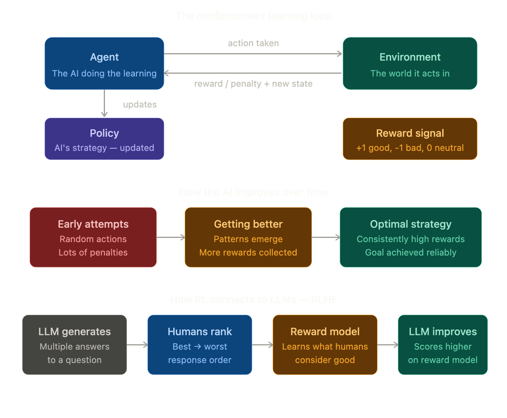

### RL vs The Other Learning Types

You've now learned three types of machine learning — here's how they compare:

| Type | How it learns | Example |
|------|--------------|---------|
| **Self-supervised** | Predicts hidden parts of data | Fill-in-the-blank on internet text |
| **Supervised** | Learns from labelled examples | "This email = spam" |
| **Reinforcement** | Learns from rewards and penalties | Trial and error with feedback |

Most modern LLMs like Claude use **all three** at different stages:
1. **Self-supervised** — pre-training on massive text
2. **Supervised** — fine-tuning on curated examples
3. **Reinforcement (RLHF)** — polishing behaviour with human feedback

### Famous RL Breakthroughs

RL has produced some of the most jaw-dropping AI achievements:

- **AlphaGo (2016)** — DeepMind's RL agent beat the world champion at Go — a game with more possible positions than atoms in the universe
- **OpenAI Five (2019)** — Beat world champion Dota 2 players after playing the equivalent of 45,000 years of games against itself
- **AlphaFold (2020)** — Used RL-inspired techniques to solve protein folding — a 50-year-old biology problem
- **Claude & ChatGPT** — RLHF makes responses helpful, safe, and aligned with human values

### The Explore vs Exploit Dilemma

One of the most fascinating challenges in RL:

**Exploit** — Keep doing what already works (safe but limited)
**Explore** — Try new things that might work better (risky but potentially much better)

Too much exploitation → the AI gets stuck doing the same thing forever
Too much exploration → the AI wastes time on random bad actions

Great RL systems **balance both** — like a chef who mostly makes their best dishes but occasionally experiments with new recipes.

### One Line Summary
> Reinforcement Learning is a training method where AI learns by trying actions, receiving rewards or penalties, and gradually discovering the best strategy — like training a dog, but with numbers instead of treats.

</details>

<details>
  <summary>Chain of Thought</summary>

## Chain of Thought (CoT)

### The Simple Definition
Chain of Thought is a prompting technique where you encourage the AI to **show its reasoning step by step** before giving a final answer — rather than jumping straight to a conclusion.

> Instead of asking the AI for an answer, you ask it to **think out loud** first.

### Real-Life Analogy

Think back to **maths class**:

**Bad student habit:**
> *Question: "If a train travels 60 mph for 2.5 hours, how far does it go?"*
> Student writes: **"150"** ← just the answer, no working shown

**Good student habit:**
> *"Speed = 60 mph. Time = 2.5 hours. Distance = Speed × Time. So Distance = 60 × 2.5 = 150 miles."*

The second student is **less likely to make mistakes** because each step checks the previous one. If something goes wrong, you can see exactly where.

Chain of Thought makes the AI work like the **good student** — showing every step of its reasoning.

### Why does showing steps help?

This seems almost too simple — but it works for a deep reason.

Remember how LLMs generate text? **Token by token**, each word influenced by everything before it. When the AI writes out its reasoning step by step, each new step is informed by the **correct previous steps** — building a chain of correct logic rather than guessing the end from the beginning.

> Writing the reasoning **is** the reasoning. The act of generating the steps actually helps the model think more accurately.

### The Two Ways to Use CoT

**1. Zero-shot CoT** — Just add a magic phrase:
> *"Let's think step by step."*
> That's literally it — and it measurably improves accuracy!

**2. Few-shot CoT** — Show examples of step-by-step reasoning:
> Give 2–3 examples where you show the full working, then ask your question.

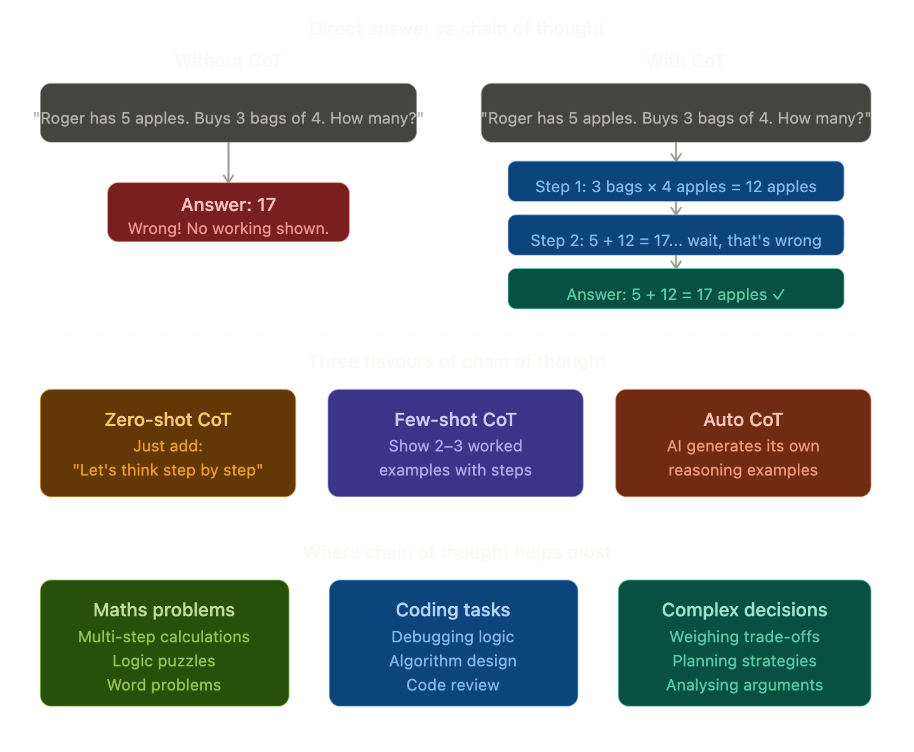


### CoT and Extended Thinking

You may have heard about **extended thinking** in models like Claude. This is CoT taken to the next level:

- The model gets a **dedicated thinking space** before it responds
- It reasons through the problem extensively — exploring multiple paths, second-guessing itself, backtracking
- Only then does it produce its final polished answer

> It's like the difference between answering a question off the top of your head vs having 10 minutes to **think it through on a whiteboard** first.

This is one reason why newer AI models are dramatically better at hard reasoning tasks — they're not just answering, they're **genuinely thinking first**.

### The "Let's Think Step by Step" Experiment 

Researchers at Google found that simply adding the phrase:

> *"Let's think step by step."*

...to a prompt increased AI accuracy on maths problems from **17.7% to 78.7%** — a massive jump from four words!

This is one of the most striking results in all of prompt engineering research.

### How CoT Connects to What You've Learned

| Concept | Connection to CoT |
|---------|------------------|
| **Attention** | Each reasoning step attends to previous steps — building correctly |
| **Tokens** | More tokens = more reasoning space = better answers |
| **Few-shot prompting** | CoT examples are a special type of few-shot prompt |
| **Agents** | Agents use CoT internally to plan their next action |
| **Context Engineering** | Including CoT instructions is a key context engineering technique |


### When CoT is NOT helpful

CoT isn't always the answer:

- **Simple factual questions** — *"What is the capital of France?"* — no need for steps
- **Creative writing** — reasoning steps can interrupt the creative flow
- **Time-sensitive tasks** — CoT uses more tokens and takes slightly longer

Use it when the task involves **multiple steps, logic, or calculation** — skip it for straightforward lookups.

### One Line Summary
> Chain of Thought is a technique where you ask the AI to reason through a problem step by step before answering — dramatically improving accuracy on complex tasks by making the AI think out loud.

</details>

<details>
  <summary>Reasoning Models</summary>

## Reasoning Models

### The Simple Definition
Reasoning Models are a special class of AI models that have been **trained to think deeply before answering** — spending time internally exploring a problem, checking their work, and reconsidering before giving a final response.

> Regular models **respond**. Reasoning models **think, then respond**.

### Real-Life Analogy

Think of the difference between two types of people answering a hard question 🎓:

**Regular model — the quick responder:**
> Someone fires an answer immediately based on instinct and memory. Fast. Usually fine for easy questions. But on hard problems — prone to mistakes.

**Reasoning model — the careful thinker:**
> Someone says *"give me a moment"*, picks up a pen, works through the problem on paper, crosses things out, tries a different approach, double checks — then gives a confident, well-reasoned answer.

Same person, same knowledge — but the **thinking process** makes the second answer far more reliable on hard problems.

### How is this different from Chain of Thought?

Great question — they're closely related but importantly different:

| | Chain of Thought | Reasoning Models |
|--|-----------------|-----------------|
| **What it is** | A prompting technique | A type of model |
| **Who controls it** | You — by adding instructions | Built into the model itself |
| **Thinking visible?** | Yes — in the response | Often hidden — internal only |
| **Training** | No special training needed | Specifically trained via RL to reason |
| **Quality** | Good | Much better — deeper, more reliable |

> CoT is like **asking** someone to show their work. Reasoning models are **trained from birth** to always think deeply — they can't help it.

### The Secret Ingredient — Reinforcement Learning

Remember Reinforcement Learning from last term? This is where it gets exciting.

Reasoning models are trained using RL with a very clever reward signal:
- **Getting the right answer** → reward ⬆️
- **Getting the wrong answer** → penalty ⬇️
- The model discovers **entirely on its own** that thinking step by step leads to more rewards

Nobody programmed the reasoning strategy in. The model **discovered through RL** that careful thinking leads to better outcomes — and kept doing more of it.

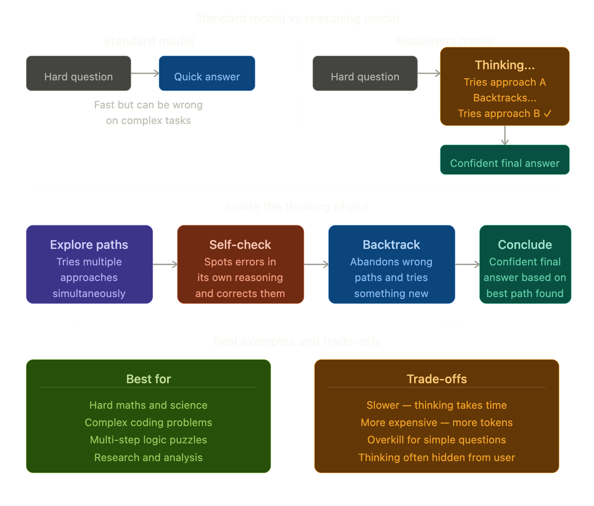

### Famous Reasoning Models Today

| Model | Company | Notable for |
|-------|---------|------------|
| **o1, o3** | OpenAI | First widely known reasoning models |
| **Claude 3.7 Sonnet** | Anthropic | Extended thinking mode — you can watch it reason |
| **Gemini 2.0 Flash Thinking** | Google | Fast reasoning at lower cost |
| **DeepSeek R1** | DeepSeek | Open source reasoning model — shocked the industry |

### The "Aha Moment" — Emergent Reasoning

One of the most fascinating discoveries about reasoning models is that when trained with RL, they developed behaviours **nobody programmed**:

- **Self-verification** — double checking their own answers
- **Backtracking** — saying *"wait, that's wrong, let me reconsider"*
- **Alternative approaches** — *"let me try a different method"*
- **Uncertainty acknowledgement** — *"I'm not sure about this step"*

These behaviours **emerged spontaneously** from RL training — the model discovered that these habits lead to more rewards. This is one of the most remarkable things happening in AI research right now.

### Thinking Tokens — The Cost of Reasoning

Reasoning models use special **thinking tokens** — tokens the model generates internally as it thinks, before producing the visible response.

- These thinking tokens **aren't shown to you** (usually)
- But they **cost compute time and money**
- A complex maths problem might use thousands of thinking tokens before giving a one-line answer

This is the core trade-off: **slower and more expensive, but dramatically more accurate** on hard problems.

### When to Use a Reasoning Model vs a Standard Model

| Task | Use |
|------|-----|
| Write me a poem | Standard model — faster, cheaper |
| Summarise this article | Standard model |
| Solve this calculus problem | Reasoning model |
| Debug this complex algorithm | Reasoning model |
| Plan my week | Either works |
| Prove this mathematical theorem | Reasoning model — definitely! |

### How Everything Connects

| Concept | Connection to Reasoning Models |
|---------|-------------------------------|
| **Chain of Thought** | The prompting technique that inspired reasoning models |
| **Reinforcement Learning** | How reasoning models are trained to think deeply |
| **Tokens** | Thinking tokens are the currency of reasoning |
| **Attention** | Attends over its own reasoning steps to stay on track |
| **Agents** | Reasoning models make far better agents — better planners |

### One Line Summary
> Reasoning models are AI models specifically trained — using Reinforcement Learning — to think through problems deeply before answering, exploring multiple paths, catching their own mistakes, and backtracking when needed.

</details>

<details>
  <summary>Multi-modal Models</summary>

## Multi-modal Models

### The Simple Definition
A Multi-modal Model is an AI that can **understand and work with multiple types of input** — not just text, but also images, audio, video, documents, and more — all within the same model.

> "Modal" means type of data. "Multi-modal" means **many types of data**.

### Real-Life Analogy

Think about how **you** experience the world:

You don't just read text. You **see** images, **hear** sounds, **watch** videos, **read** documents — and your brain combines all of these seamlessly into one understanding.

When a friend sends you a photo of a restaurant menu and asks *"what should I order?"* — you read the text on the menu, look at the food photos, and combine it all to give advice.

**Multi-modal models do exactly this** — they process different types of information and reason across all of them together.

### The Evolution of AI Modalities

| Era | What AI could handle |
|-----|---------------------|
| **Early AI** | Text only |
| **Image AI** | Images only (separate models) |
| **Multi-modal AI** | Text + images together |
| **Today's frontier** | Text + images + audio + video + documents + code |

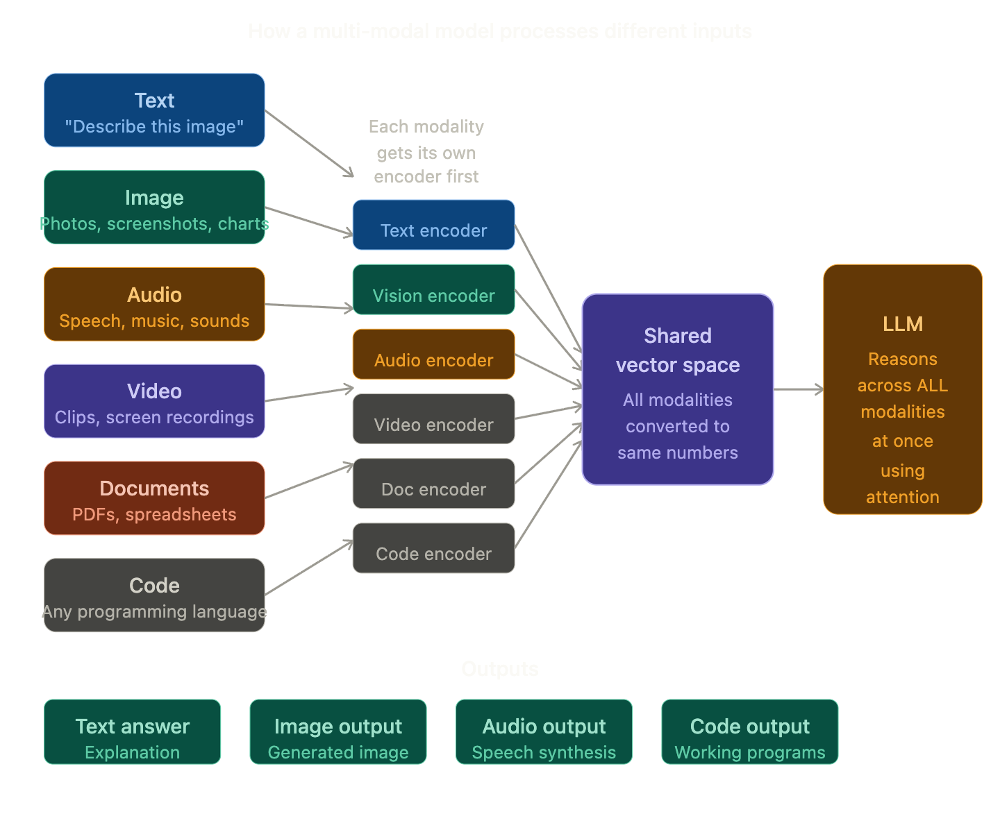

### The Secret — A Shared Vector Space

Remember **Vectorisation** from early in our journey? This is where it pays off beautifully.

The trick behind multi-modal models is converting **every type of input into the same kind of vector**:

- An image of a cat → vector `[0.9, 0.1, 0.8...]`
- The word "cat" → vector `[0.9, 0.1, 0.7...]`

**They end up close together in vector space!** This means the model understands that the image and the word refer to the same concept — purely through numbers. This is called a **shared embedding space**.

### Real World Examples 

**Claude**
> Upload a photo of your handwritten notes → Claude reads and summarises them
> Share a screenshot of an error → Claude diagnoses the bug

**GPT-4o by OpenAI**
> Speak to it naturally → it understands your voice, tone, and emotion
> Show it a maths problem on paper → it solves it

**Gemini by Google**
> Show it a video → it describes what's happening frame by frame
> Share a chart → it analyses the data trends

### Input vs Output Modalities

Not all multi-modal models can both **receive and produce** every type:

| Model type | Input | Output |
|-----------|-------|--------|
| **Vision-language** | Text + images | Text only |
| **Speech models** | Text + audio | Text + audio |
| **Full multi-modal** | Text + image + audio + video | Text + image + audio |
| **Omni models** | Everything | Everything |

### Why This is Hard to Build

Combining modalities is technically very challenging:

- **Different data structures** — text is sequential, images are grids of pixels, audio is waves
- **Different scales** — an image has millions of pixels, a sentence has tens of words
- **Alignment problem** — teaching the model that a photo of a dog and the word "dog" mean the same thing

The breakthrough that made this possible was — you guessed it — **the Transformer and the shared vector space**. Attention can operate across any sequence of vectors, regardless of what they originally came from.

### How Everything Connects

| Concept | Connection to Multi-modal Models |
|---------|--------------------------------|
| **Vectorisation** | Every modality gets converted to vectors |
| **Attention** | Attends across all modalities simultaneously |
| **Transformer** | Architecture flexible enough to handle any input |
| **Fine-tuning** | Models fine-tuned on paired data (image + caption) |
| **RAG** | Can now retrieve images AND text as context |

### One Line Summary
> Multi-modal models are AI systems that can understand and reason across multiple types of input — text, images, audio, video, and more — all within a single unified model, just like a human brain.

</details>

<details>
  <summary>Small Language Models</summary>

## SLM — Small Language Models

### The Simple Definition
A Small Language Model is a language model that has been designed to be **intentionally compact** — fewer parameters, less memory, lower compute — while still being surprisingly capable at specific tasks.

> If an LLM is a **massive library** , an SLM is a **focused pocket handbook** — smaller, lighter, and built for a specific job.

### Real-Life Analogy

Think of the difference between two doctors:

**Large Language Model — the encyclopaedia specialist:**
A doctor who has read every medical textbook, research paper, and case study ever written. Knows everything about everything. But needs a huge hospital with expensive equipment to operate.

**Small Language Model — the field medic:**
A highly trained specialist who knows exactly what they need for battlefield medicine. Travels light, works anywhere — a backpack and a kit. Can't do brain surgery, but brilliant at what they do.

Both are valuable. The right choice depends entirely on **what you need and where you are**.

### LLM vs SLM — Head to Head

| | LLM | SLM |
|--|-----|-----|
| **Parameters** | Billions–Trillions | Millions–few Billions |
| **Runs on** | Data centre GPUs | Laptop, phone, edge device |
| **Cost** | Expensive to run | Very cheap |
| **Speed** | Slower | Much faster |
| **Knowledge** | Broad — knows everything | Narrow — expert at one thing |
| **Privacy** | Data leaves your device | Can run fully offline |
| **Examples** | GPT-4, Claude, Gemini Ultra | Phi, Gemma, Mistral 7B |


### The Three Ways to Make a Model Smaller

**1. Distillation — the teacher-student approach**
Train a small "student" model to mimic the outputs of a large "teacher" model. The student learns the teacher's knowledge in a compressed form. Result: a small model that punches above its weight.

**2. Pruning — cutting the fat**
Remove the weights (connections) inside the model that contribute the least to its outputs. Like trimming dead branches from a tree — the tree still works, just lighter.

**3. Quantisation — rounding the numbers**
Neural networks store numbers with high precision (32 bits per number). Quantisation rounds these to lower precision (4 or 8 bits). The model gets 4–8x smaller with surprisingly little quality loss.

### Why SLMs Matter — The Big Picture

SLMs are exciting for reasons beyond just being cheap:

**Privacy** — Your data never leaves your device. Medical records, personal notes, confidential documents — processed locally with zero data leakage.

**Speed** — No network roundtrip. Response is instant. Critical for real-time applications like voice assistants or autonomous vehicles.

**Offline capability** — Works in remote areas, on aircraft, in secure environments with no internet.

**Cost at scale** — Running millions of queries on a tiny model costs a fraction of a large one. For high-volume apps, this is enormous.

**Democratisation** — Anyone with a laptop can now run a capable AI model locally. No API key, no subscription, no cloud.

### The Surprising Truth

Recent SLMs have been shocking the AI world:

> **Phi-3 Mini** (3.8 billion parameters) by Microsoft outperforms models **10x its size** on many benchmarks — because it was trained on extremely high-quality curated data rather than raw internet text.

This tells us: **data quality can beat model size**. A small model fed excellent data can outperform a huge model fed average data.

### Choosing the Right Size — A Simple Guide

| Situation | Use |
|-----------|-----|
| Complex reasoning, broad knowledge | LLM |
| Running on a phone or laptop | SLM |
| Privacy-sensitive data | SLM (local) |
| High-volume, cost-sensitive app | SLM |
| Creative writing, nuanced tasks | LLM |
| Embedded in a product or device | SLM |
| Research, analysis, deep tasks | LLM |
| Fast, simple, repetitive tasks | SLM |

### One Line Summary
> Small Language Models are intentionally compact AI models — built to run on everyday devices like phones and laptops — trading broad knowledge for speed, privacy, low cost, and the ability to work completely offline.

</details>

<details>
  <summary>Distillation</summary>

## Distillation (Knowledge Distillation)

### The Simple Definition
Distillation is a technique where a **large, powerful model (the teacher) trains a smaller, efficient model (the student)** by passing on its knowledge — not just the right answers, but the *reasoning patterns and confidence levels* behind those answers.

> It's not just copying answers. It's **transferring wisdom**.

### Real-Life Analogy

Think of a **master chef training an apprentice**:

**Bad training:**
The apprentice just reads the recipe book (standard training on data). They know the steps but don't understand *why* certain techniques work.

**Distillation training:**
The master chef **works alongside the apprentice every day** — explaining not just *what* to do but *why* this temperature, *why* this timing, *why* this texture matters. The apprentice absorbs the master's intuition, not just their recipes.

The apprentice will never be as experienced as the master — but they'll be **far better than if they'd just read the book alone**.

### The Key Insight — Soft Labels

This is the clever bit that makes distillation work so well.

When you train a model normally, it learns from **hard labels**:
> Photo of a cat → answer: **"cat"** (100% cat, 0% everything else)

But a teacher model gives **soft labels** — probability distributions:
> Photo of a cat → **"cat: 85%, kitten: 10%, tiger: 3%, dog: 2%"**

Those soft labels contain **so much more information**! They tell the student:
- Cats and kittens are very similar
- Cats are somewhat related to tigers
- Cats are very different from cars

> The teacher's *uncertainty* is actually **rich knowledge** about how the world is structured.


### The Three Things a Student Learns

Distillation is richer than simple training because the student learns from three sources simultaneously:

**1. The correct answers** (same as normal training)
> "This is a cat"

**2. The teacher's soft probability distributions**
> "Cat 85%, kitten 10%, tiger 3%..." — teaches relationships between concepts

**3. The teacher's intermediate reasoning**
> In advanced distillation, the student also learns to mimic the teacher's internal hidden states — not just outputs but the *thinking process* itself

### Types of Distillation

| Type | What's transferred | Example |
|------|--------------------|---------|
| **Response distillation** | Final output probabilities | Most common — student mimics teacher answers |
| **Feature distillation** | Internal hidden layer activations | Student mimics *how* teacher thinks |
| **Relation distillation** | Relationships between examples | Student learns which examples are similar |
| **Online distillation** | Teacher and student train together | Both improve simultaneously |

### A Famous Real Example — DeepSeek R1

In early 2025, a Chinese AI lab called DeepSeek released **DeepSeek R1** — a powerful reasoning model. They then distilled it into much smaller versions:

- **DeepSeek-R1-Distill-7B** — 7 billion parameters
- **DeepSeek-R1-Distill-1.5B** — tiny enough to run on a laptop

These small distilled models **outperformed many larger models** on reasoning benchmarks — shocking the AI industry and proving that distillation, done well, is extraordinarily powerful.

### Distillation vs Fine-tuning — What's the difference?

You learned about Fine-tuning earlier — here's how they differ:

| | Fine-tuning | Distillation |
|--|-------------|-------------|
| **Starting point** | Pre-trained model | Pre-trained model |
| **Teacher needed?** | No | Yes — a larger model |
| **Goal** | Change behaviour or specialise | Compress knowledge into smaller model |
| **Output** | Same-sized, different-behaving model | Smaller, cheaper, faster model |
| **Uses soft labels?** | No | Yes — that's the key ingredient |

### How Everything Connects

| Concept | Connection to Distillation |
|---------|--------------------------|
| **LLM** | The teacher model |
| **SLM** | Often the result of distillation |
| **Fine-tuning** | Often applied after distillation to specialise further |
| **Reinforcement Learning** | Can be combined — distil RL-trained reasoning models |
| **Vectorisation** | Soft labels are distributions over the vocabulary vector space |

### One Line Summary
> Distillation is a training technique where a large powerful model (teacher) transfers its knowledge to a small efficient model (student) — not just through correct answers, but through rich probability distributions that encode how the world is structured.

</details>

<details>
  <summary>Quantisation</summary>

## Quantisation

### The Simple Definition
Quantisation is a technique that **reduces the precision of the numbers** used to store a model's weights — making the model **smaller and faster** with surprisingly little loss in quality.

> It's like converting a high-resolution photo into a compressed JPEG — smaller file, still looks great, barely noticeable difference.

### Real-Life Analogy

Imagine measuring the temperature outside:

**High precision (32-bit):**
> "It is **23.48291746°C**"

**Quantised (4-bit):**
> "It is **23°C**"

For most purposes — deciding what to wear, planning a picnic — **23°C is perfectly good enough**. The extra decimal places are unnecessary precision that just wastes space.

Quantisation applies this same logic to the billions of numbers inside a neural network — **rounding them to use less storage** while keeping the model's behaviour almost identical.

### Why Does Precision Matter So Much?

Every number in a neural network (every weight) is stored in computer memory. The more precise the number, the more memory it takes:

| Format | Bits per number | Memory for 7B model |
|--------|----------------|---------------------|
| **FP32** (full precision) | 32 bits | ~28 GB |
| **FP16** (half precision) | 16 bits | ~14 GB |
| **INT8** (8-bit int) | 8 bits | ~7 GB |
| **INT4** (4-bit int) | 4 bits | ~3.5 GB |

> A 7 billion parameter model goes from needing a **$10,000 GPU** to fitting in **your laptop's RAM** — just by quantising!

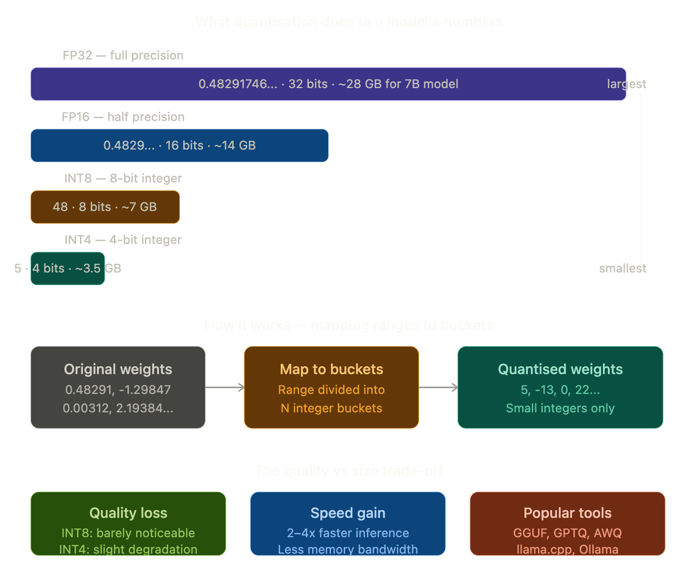

### The Brilliant Bucket Trick

Here's the core idea made simple:

Imagine all the weights in a model range from **-3.0 to +3.0**.

**FP32** stores each number with full decimal precision — like a ruler marked in millimetres.

**INT4** divides that same range into just **16 buckets** (because 4 bits = 16 possible values):

```
Bucket:   0    1    2  ...  8  ...  14   15
Value:  -3.0 -2.6 -2.2 ... 0.0 ... 2.2  3.0
```

Every original weight gets **rounded to its nearest bucket**. The model stores the bucket number (0–15) instead of the precise decimal.

The rounding introduces a tiny error — but across billions of weights, these errors mostly **cancel each other out**, leaving model quality surprisingly intact.

### Types of Quantisation

| Type | How it works | Best for |
|------|-------------|---------|
| **Post-training quantisation (PTQ)** | Quantise after training is done | Fast, easy, most common |
| **Quantisation-aware training (QAT)** | Train the model while simulating quantisation | Best quality, but slower to train |
| **Mixed precision** | Different layers use different precision | Balance quality and speed per layer |
| **GGUF / GPTQ / AWQ** | Popular formats for quantised models | Running models locally with tools like Ollama |

### The Practical Magic — Running AI on Your Laptop

Thanks to quantisation, you can today:

- Download **Llama 3 (8B)** quantised to 4-bit — **~4.5 GB** — and run it entirely on your laptop
- Use **Ollama** or **LM Studio** — free tools that handle quantisation automatically
- Get responses in seconds with **no internet, no API key, no cost**

This was completely impossible just 3 years ago.

### Quantisation vs Distillation vs Pruning — the SLM trio

You've now learned all three model compression techniques:

| Technique | What it reduces | How |
|-----------|----------------|-----|
| **Distillation** | Model architecture size | Train small model to mimic large one |
| **Pruning** | Number of weights | Remove unimportant connections |
| **Quantisation** | Precision of weights | Round numbers to fewer bits |

They're often used **together** — distil first, then prune, then quantise — stacking the savings for maximum compression!

### How Everything Connects

| Concept | Connection to Quantisation |
|---------|--------------------------|
| **Vectorisation** | Vectors are stored as floating point numbers — quantisation compresses those |
| **SLM** | Quantisation is one of the key techniques to create SLMs |
| **Distillation** | Often applied together — distil then quantise |
| **Agents** | Quantised models enable agents to run on edge devices |
| **Fine-tuning** | Can fine-tune after quantisation to recover lost quality |

### One Line Summary
> Quantisation reduces the precision of a model's numbers from 32-bit decimals down to 4 or 8-bit integers — shrinking model size by up to 8x and enabling powerful AI to run on everyday devices like laptops and phones.

</details>