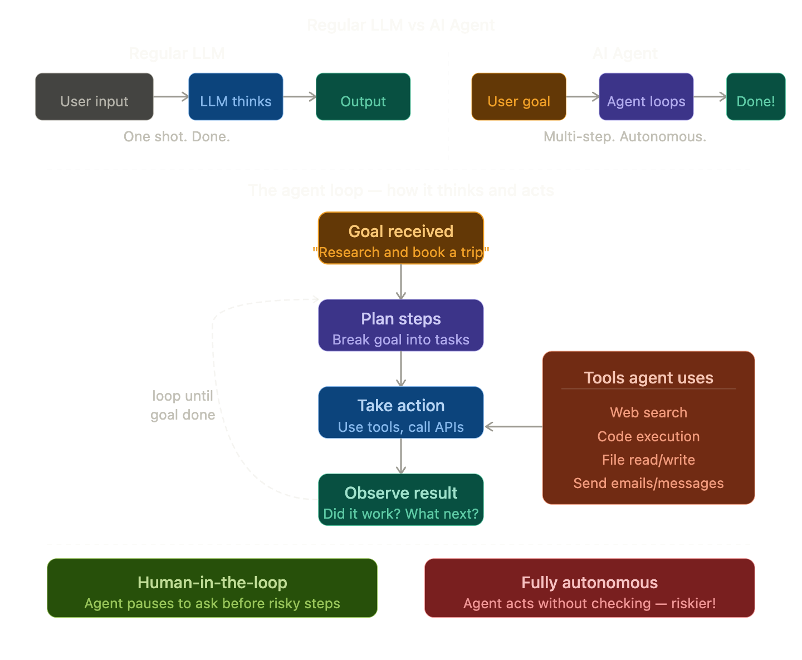

## AI Agents

### The Simple Definition
An AI Agent is an AI that can **plan, make decisions, use tools, and take a sequence of actions** to complete a goal — with little or no human involvement at each step.

> A regular LLM **responds**. An AI Agent **acts**.

### Real-Life Analogy

Think of the difference between two types of assistants:

**Regular LLM — like a consultant:**
You ask a question → they give you advice → you go do it yourself.
> *"Here's how you could book that flight..."*

**AI Agent — like a personal assistant:**
You give them a goal → they figure out the steps → they do it all themselves.
> *"Done! I checked three airlines, found the cheapest option, booked it, added it to your calendar, and emailed the hotel."*

The Agent doesn't wait to be asked each step — it **figures out what needs doing next** and does it.

### The Key Difference — Loops

A regular LLM goes in a straight line:
> Input → Think → Output. Done.

An Agent goes in a **loop**:
> Goal → Plan → Act → Observe result → Re-plan → Act again → ... → Goal achieved!

This loop is what makes agents powerful — and also what makes them tricky to build safely.

### How Everything You've Learned Powers Agents

This is where it all comes together beautifully:

| What agents use | Term you learned |
|----------------|-----------------|
| Understanding language | **LLM + Transformer** |
| Processing input | **Tokenisation + Vectorisation** |
| Finding relevant info | **RAG + Vector Database** |
| Connecting to tools | **MCP** |
| Staying on task | **Context Engineering** |
| Knowing how to behave | **Fine-tuning + RLHF** |

An Agent is essentially **all your previous terms working together in a loop**!

### Real World Agent Examples

**Coding Agent** (like Claude Code)
> *"Fix all the bugs in my codebase"*
> Reads files → identifies bugs → writes fixes → runs tests → fixes more bugs → reports done

**Research Agent**
> *"Write me a market analysis report on electric vehicles"*
> Searches web → reads articles → takes notes → searches more → synthesises → writes report

**Personal Assistant Agent**
> *"Plan my trip to Tokyo next month"*
> Checks calendar → searches flights → compares hotels → books best options → creates itinerary → sends confirmation

### The Safety Question

Agents are powerful but come with real risks:

- What if the agent **misunderstands** the goal?
- What if it takes an **irreversible action** like deleting files or sending emails?
- What if it gets **stuck in a loop** and keeps taking actions endlessly?

This is why most good agent systems have **human-in-the-loop** checkpoints — pausing before risky or irreversible actions to ask: *"Are you sure you want me to do this?"*

### Multi-Agent Systems

The frontier of AI today is **multiple agents working together**:

- **Orchestrator agent** — breaks the big goal into sub-tasks
- **Specialist agents** — each handles one sub-task (research, writing, coding)
- **Checker agent** — reviews the work of others

Like a company where each employee has a specific role — except all employees are AI!

### One Line Summary
> An AI Agent is an LLM that can plan, use tools, take actions, observe results, and loop — completing complex multi-step goals autonomously rather than just answering a single question.