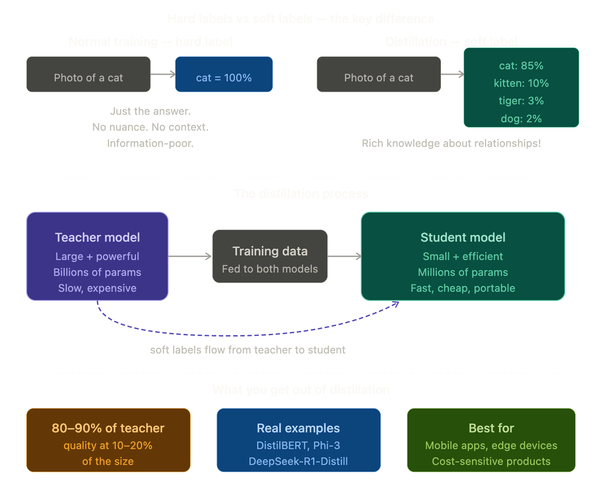

## Distillation (Knowledge Distillation)

### The Simple Definition
Distillation is a technique where a **large, powerful model (the teacher) trains a smaller, efficient model (the student)** by passing on its knowledge — not just the right answers, but the *reasoning patterns and confidence levels* behind those answers.

> It's not just copying answers. It's **transferring wisdom**.

### Real-Life Analogy

Think of a **master chef training an apprentice**:

**Bad training:**
The apprentice just reads the recipe book (standard training on data). They know the steps but don't understand *why* certain techniques work.

**Distillation training:**
The master chef **works alongside the apprentice every day** — explaining not just *what* to do but *why* this temperature, *why* this timing, *why* this texture matters. The apprentice absorbs the master's intuition, not just their recipes.

The apprentice will never be as experienced as the master — but they'll be **far better than if they'd just read the book alone**.

### The Key Insight — Soft Labels

This is the clever bit that makes distillation work so well.

When you train a model normally, it learns from **hard labels**:
> Photo of a cat → answer: **"cat"** (100% cat, 0% everything else)

But a teacher model gives **soft labels** — probability distributions:
> Photo of a cat → **"cat: 85%, kitten: 10%, tiger: 3%, dog: 2%"**

Those soft labels contain **so much more information**! They tell the student:
- Cats and kittens are very similar
- Cats are somewhat related to tigers
- Cats are very different from cars

> The teacher's *uncertainty* is actually **rich knowledge** about how the world is structured.

### The Three Things a Student Learns

Distillation is richer than simple training because the student learns from three sources simultaneously:

**1. The correct answers** (same as normal training)
> "This is a cat"

**2. The teacher's soft probability distributions**
> "Cat 85%, kitten 10%, tiger 3%..." — teaches relationships between concepts

**3. The teacher's intermediate reasoning**
> In advanced distillation, the student also learns to mimic the teacher's internal hidden states — not just outputs but the *thinking process* itself

### Types of Distillation

| Type | What's transferred | Example |
|------|--------------------|---------|
| **Response distillation** | Final output probabilities | Most common — student mimics teacher answers |
| **Feature distillation** | Internal hidden layer activations | Student mimics *how* teacher thinks |
| **Relation distillation** | Relationships between examples | Student learns which examples are similar |
| **Online distillation** | Teacher and student train together | Both improve simultaneously |

### A Famous Real Example — DeepSeek R1

In early 2025, a Chinese AI lab called DeepSeek released **DeepSeek R1** — a powerful reasoning model. They then distilled it into much smaller versions:

- **DeepSeek-R1-Distill-7B** — 7 billion parameters
- **DeepSeek-R1-Distill-1.5B** — tiny enough to run on a laptop

These small distilled models **outperformed many larger models** on reasoning benchmarks — shocking the AI industry and proving that distillation, done well, is extraordinarily powerful.

### Distillation vs Fine-tuning — What's the difference?

You learned about Fine-tuning earlier — here's how they differ:

| | Fine-tuning | Distillation |
|--|-------------|-------------|
| **Starting point** | Pre-trained model | Pre-trained model |
| **Teacher needed?** | No | Yes — a larger model |
| **Goal** | Change behaviour or specialise | Compress knowledge into smaller model |
| **Output** | Same-sized, different-behaving model | Smaller, cheaper, faster model |
| **Uses soft labels?** | No | Yes — that's the key ingredient |

### How Everything Connects

| Concept | Connection to Distillation |
|---------|--------------------------|
| **LLM** | The teacher model |
| **SLM** | Often the result of distillation |
| **Fine-tuning** | Often applied after distillation to specialise further |
| **Reinforcement Learning** | Can be combined — distil RL-trained reasoning models |
| **Vectorisation** | Soft labels are distributions over the vocabulary vector space |

### One Line Summary
> Distillation is a training technique where a large powerful model (teacher) transfers its knowledge to a small efficient model (student) — not just through correct answers, but through rich probability distributions that encode how the world is structured.