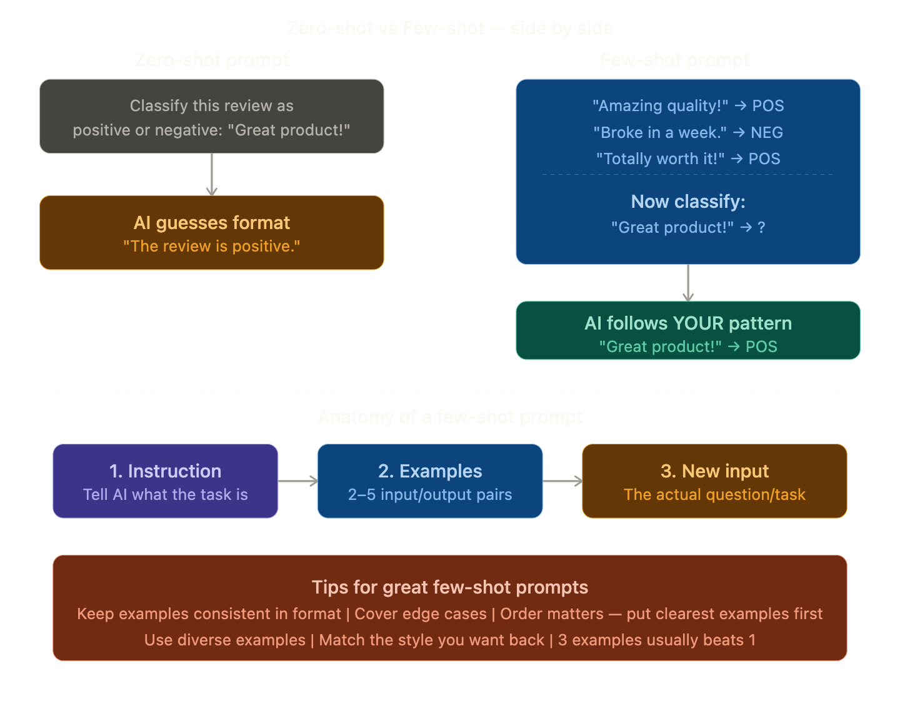

## Few-Shot Prompting

### The Simple Definition
Few-shot prompting is a technique where you **give the AI a few examples** of what you want **inside your prompt itself**, before asking it to do the actual task.

> You're not training the AI — you're just **showing it the pattern** you want it to follow, right in the conversation.

### Real-Life Analogy

Imagine you're a **new employee** and your boss gives you a task:

**Bad briefing:**
> "Write product descriptions for our store."

You'd probably guess what format they want and get it wrong.

**Good briefing:**
> "Here are two product descriptions we've already written... *(shows examples)*... Now write one for this new product."

Now you know exactly the **tone, length, and format** they want. That's few-shot prompting!

### The "Shot" Family

| Name | Examples given | When to use |
|------|---------------|-------------|
| **Zero-shot** | 0 examples | Simple tasks AI already knows well |
| **One-shot** | 1 example | When you have one clear example |
| **Few-shot** | 2–5 examples | Best for specific patterns or formats |
| **Many-shot** | 10+ examples | Complex, highly specific tasks |

### Real Examples You Can Use Today

**Example 1 — Tone matching:**
> Write product titles in this style:
> "Noise-cancelling headphones" → "Silence the World, Hear Your Music"
> "Waterproof jacket" → "Stay Dry, Look Sharp"
> Now do: "Running shoes" → ?

**Example 2 — Data formatting:**
> Convert to structured format:
> "John, 28, New York" → Name: John | Age: 28 | City: New York
> "Sara, 34, London" → Name: Sara | Age: 34 | City: London
> Now do: "Ahmed, 22, Dubai" → ?

### Why does it work?

Remember **Attention** and **Vectorisation**? The AI uses those mechanisms to detect the **pattern** in your examples and continue it. You're essentially guiding the attention mechanism by showing it exactly what relationships matter to you.

You're not changing the model — you're giving it a **very strong hint** from inside the prompt itself.

### Few-shot vs Fine-tuning — what's the difference?

| | Few-shot prompting | Fine-tuning |
|--|-------------------|-------------|
| **Where** | Inside the prompt | Changes the model weights |
| **Cost** | Free, instant | Expensive, takes time |
| **Persistence** | Only for that conversation | Permanent change |
| **Best for** | Quick formatting, style | Deep behavioural change |

### One Line Summary
> Few-shot prompting means giving the AI 2–5 examples of what you want inside your prompt, so it learns your exact pattern and follows it — no training required.