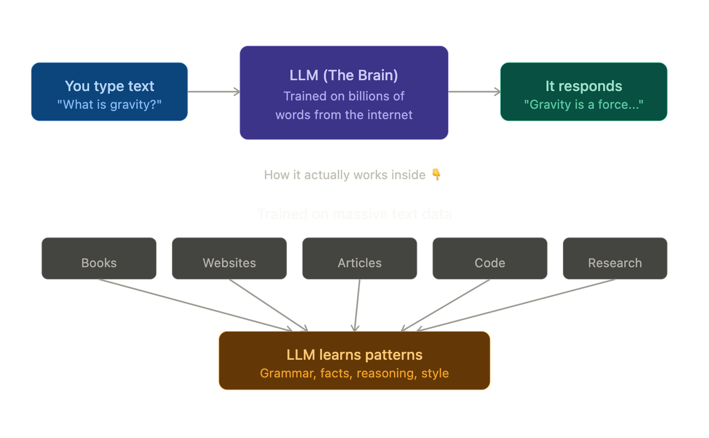

##  LLM — Large Language Model

### The Simple Definition
An LLM is an **AI that has read a massive amount of text** (books, websites, articles, code, etc.) and learned how to **understand and generate human language** from it.

### Real-Life Analogy

Imagine a student who has **read millions of books, articles, and websites** their entire life. Now when you ask them a question or give them a topic — they can **write about it, answer it, or have a conversation** because of everything they've absorbed.

An LLM is that student — except it's a computer program.

### Breaking Down the Name

| Word | What it means |
|------|--------------|
| **Large** | Trained on a huge amount of text data (think billions of web pages) |
| **Language** | It works with human language — reading and writing it |
| **Model** | A mathematical system that learned patterns from all that text |

### How does it actually work? (Super Simply)

You give it some text → It **predicts what comes next** — word by word.
That's literally it at the core!

### Real Examples of LLMs
- **ChatGPT** by OpenAI
- **Claude** by Anthropic
- **Gemini** by Google

### One Line Summary
> An LLM is a very well-read AI that learned how to talk by reading most of the internet — and now predicts the best words to respond to you.