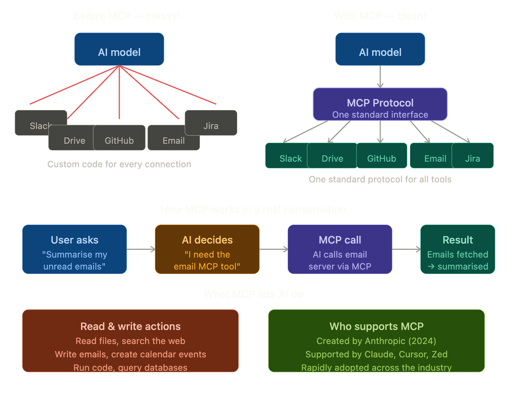

## MCP — Model Context Protocol

### The Simple Definition
MCP is a **standard way for AI models to connect to external tools, data sources, and services** — so the AI can take actions in the real world, not just generate text.

> Think of it as a **universal plug socket** for AI. Instead of every AI needing a custom connection to every tool, MCP gives one standard way to connect to anything.

### The Problem MCP Solves

Without MCP, connecting an AI to external tools was messy:

- Every company built their **own custom integration** between their AI and their tools
- Connecting Claude to Google Drive was different from connecting it to Slack, which was different from GitHub...
- Developers had to **rewrite connection code** every single time
- It was like every country having **different shaped plug sockets** — your appliance only works in one country!

MCP says: *"Let's agree on one standard shape for all plugs."*

### Real-Life Analogy

Think of **USB**:

Before USB, every device had its own connector. Printers, keyboards, mice — all different cables, all incompatible.

Then USB came along and said: *"One standard port for everything."* Suddenly any device worked with any computer.

**MCP is the USB of AI tools.** One standard protocol so any AI can connect to any tool — without custom wiring every time.

### The Three Parts of MCP

MCP has three key components that work together:

**1. MCP Host** — The AI application (like Claude)
The AI that wants to use external tools. It asks: *"What tools are available and how do I use them?"*

**2. MCP Server** — The tool provider (like Google Drive)
A small program that wraps a tool and exposes it in the standard MCP format. It says: *"Here's what I can do and how to call me."*

**3. MCP Protocol** — The agreed language between them
The standard rules both sides follow — like a contract that ensures they always understand each other.

### MCP vs RAG — what's the difference?

These two are often confused because both give AI access to external information:

| | RAG | MCP |
|--|-----|-----|
| **Purpose** | Retrieve documents for context | Connect to tools and take actions |
| **Direction** | One way — AI reads data | Two way — AI reads AND writes |
| **Example** | Search company docs for an answer | Send an email, create a task, run code |
| **Data** | Static documents | Live systems and services |

> RAG gives the AI a **library**. MCP gives the AI **hands**.

### One Line Summary
> MCP is a universal standard protocol that lets AI models connect to any external tool or service — giving AI the ability to take real actions in the world, not just generate text.