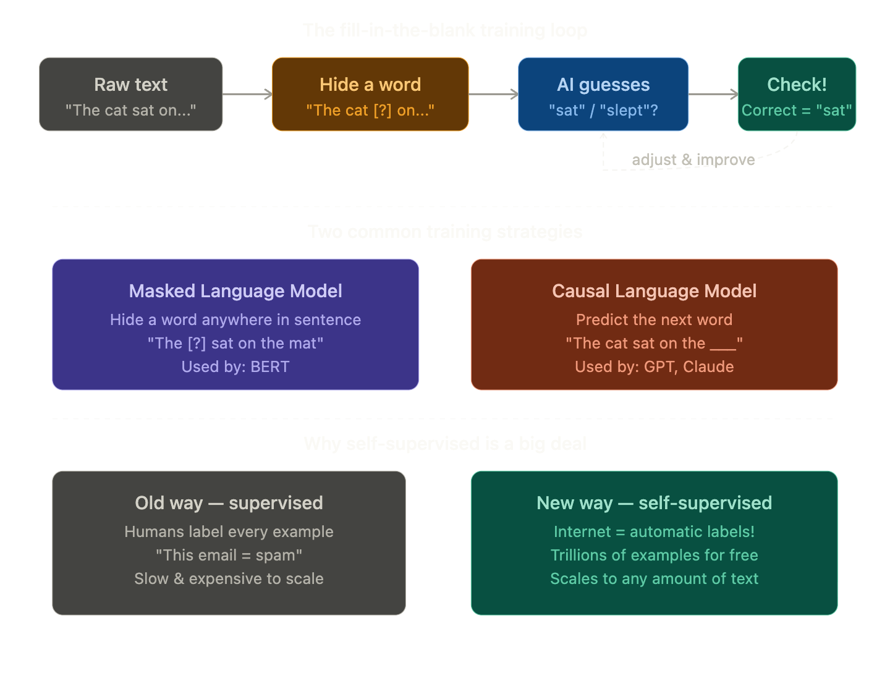

## Self-Supervised Learning

### The Simple Definition
Self-Supervised Learning is a way of training an AI where the **data creates its own labels automatically** — no human needed to manually tag anything.

> The AI learns by playing a **fill-in-the-blank game** with text — over and over, billions of times.

### Real-Life Analogy

Remember doing **fill-in-the-blank exercises** in school?

> *"The sky is ____.\"* → You write "blue"

Nobody had to tell you the answer beforehand — you already knew from **experience reading and hearing** that sentence pattern your whole life.

Self-supervised learning works the same way:
- Take a sentence from the internet
- **Hide a word**
- Ask the AI to guess it
- Tell the AI if it was right or wrong
- **Repeat billions of times**

The AI gradually gets better and better — and in doing so, it learns grammar, facts, reasoning, and meaning — all on its own!

### What does the AI actually learn from this?

By playing this guessing game **billions of times**, the AI doesn't just memorise answers — it picks up much deeper knowledge:

- **Grammar** — "The cat ___ on the mat" → needs a verb
- **Facts** — "The capital of France is ___" → Paris
- **Reasoning** — "If it's raining, take an ___" → umbrella
- **Style** — "Once upon a time ___" → story language follows

Nobody programmed any of this in. It all **emerged naturally** from the guessing game!

### The clever trick

The magic is that **every sentence on the internet is simultaneously**:
- The **training data** (input text)
- The **label** (the hidden word answer)

So the entire internet becomes a free, infinite training set!

### One Line Summary
> Self-supervised learning is how an LLM teaches itself by playing a fill-in-the-blank game on billions of internet sentences — no human labelling needed.