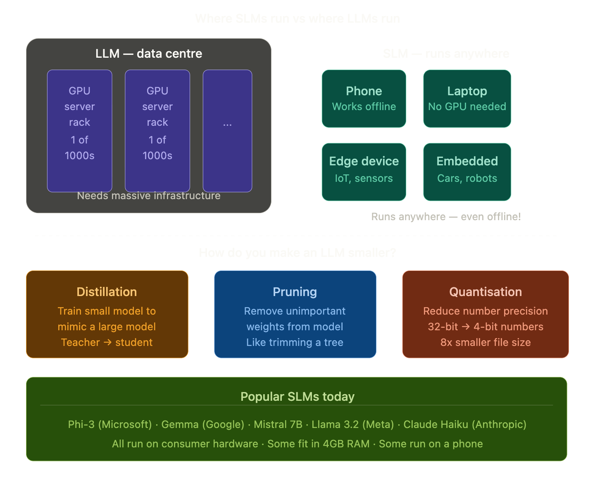

## SLM — Small Language Models

### The Simple Definition
A Small Language Model is a language model that has been designed to be **intentionally compact** — fewer parameters, less memory, lower compute — while still being surprisingly capable at specific tasks.

> If an LLM is a **massive library** , an SLM is a **focused pocket handbook** — smaller, lighter, and built for a specific job.

### Real-Life Analogy

Think of the difference between two doctors:

**Large Language Model — the encyclopaedia specialist:**
A doctor who has read every medical textbook, research paper, and case study ever written. Knows everything about everything. But needs a huge hospital with expensive equipment to operate.

**Small Language Model — the field medic:**
A highly trained specialist who knows exactly what they need for battlefield medicine. Travels light, works anywhere — a backpack and a kit. Can't do brain surgery, but brilliant at what they do.

Both are valuable. The right choice depends entirely on **what you need and where you are**.

### LLM vs SLM — Head to Head

| | LLM | SLM |
|--|-----|-----|
| **Parameters** | Billions–Trillions | Millions–few Billions |
| **Runs on** | Data centre GPUs | Laptop, phone, edge device |
| **Cost** | Expensive to run | Very cheap |
| **Speed** | Slower | Much faster |
| **Knowledge** | Broad — knows everything | Narrow — expert at one thing |
| **Privacy** | Data leaves your device | Can run fully offline |
| **Examples** | GPT-4, Claude, Gemini Ultra | Phi, Gemma, Mistral 7B |

### The Three Ways to Make a Model Smaller

**1. Distillation — the teacher-student approach**
Train a small "student" model to mimic the outputs of a large "teacher" model. The student learns the teacher's knowledge in a compressed form. Result: a small model that punches above its weight.

**2. Pruning — cutting the fat**
Remove the weights (connections) inside the model that contribute the least to its outputs. Like trimming dead branches from a tree — the tree still works, just lighter.

**3. Quantisation — rounding the numbers**
Neural networks store numbers with high precision (32 bits per number). Quantisation rounds these to lower precision (4 or 8 bits). The model gets 4–8x smaller with surprisingly little quality loss.

### Why SLMs Matter — The Big Picture

SLMs are exciting for reasons beyond just being cheap:

**Privacy** — Your data never leaves your device. Medical records, personal notes, confidential documents — processed locally with zero data leakage.

**Speed** — No network roundtrip. Response is instant. Critical for real-time applications like voice assistants or autonomous vehicles.

**Offline capability** — Works in remote areas, on aircraft, in secure environments with no internet.

**Cost at scale** — Running millions of queries on a tiny model costs a fraction of a large one. For high-volume apps, this is enormous.

**Democratisation** — Anyone with a laptop can now run a capable AI model locally. No API key, no subscription, no cloud.

### The Surprising Truth

Recent SLMs have been shocking the AI world:

> **Phi-3 Mini** (3.8 billion parameters) by Microsoft outperforms models **10x its size** on many benchmarks — because it was trained on extremely high-quality curated data rather than raw internet text.

This tells us: **data quality can beat model size**. A small model fed excellent data can outperform a huge model fed average data.

### Choosing the Right Size — A Simple Guide

| Situation | Use |
|-----------|-----|
| Complex reasoning, broad knowledge | LLM |
| Running on a phone or laptop | SLM |
| Privacy-sensitive data | SLM (local) |
| High-volume, cost-sensitive app | SLM |
| Creative writing, nuanced tasks | LLM |
| Embedded in a product or device | SLM |
| Research, analysis, deep tasks | LLM |
| Fast, simple, repetitive tasks | SLM |

### One Line Summary
> Small Language Models are intentionally compact AI models — built to run on everyday devices like phones and laptops — trading broad knowledge for speed, privacy, low cost, and the ability to work completely offline.